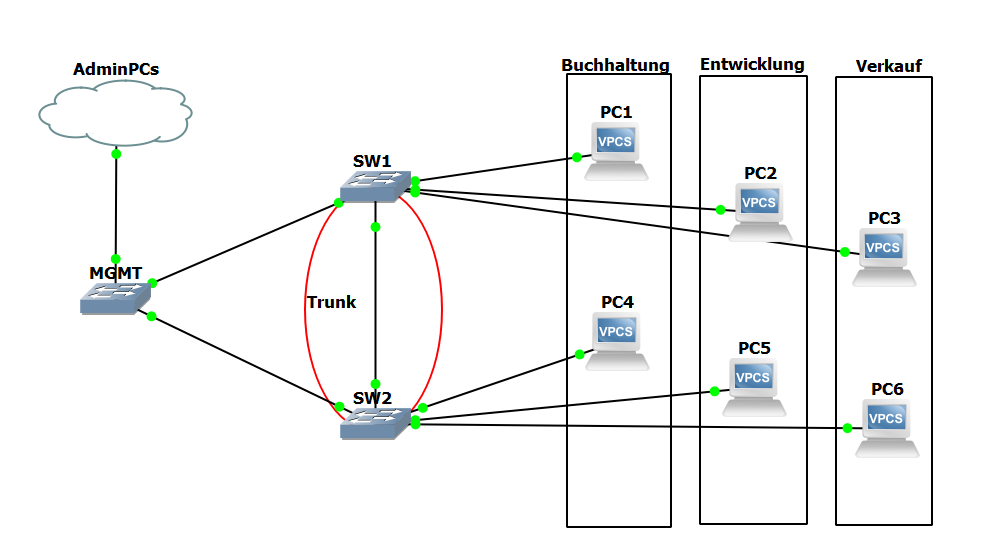
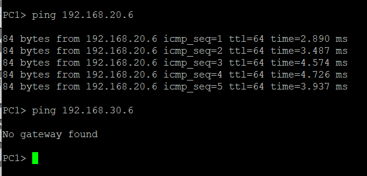
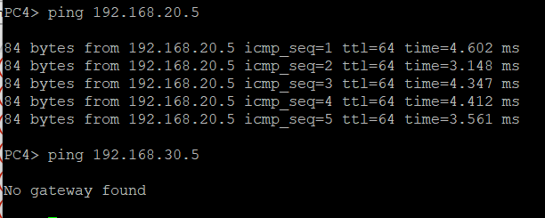
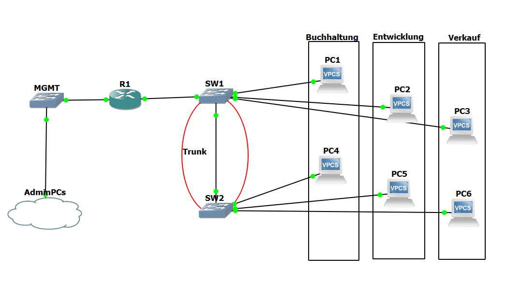
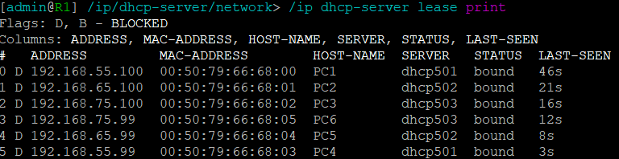
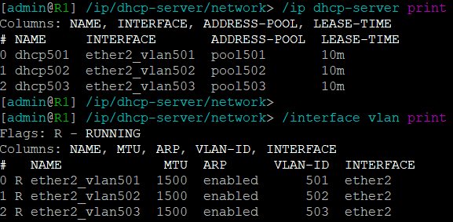
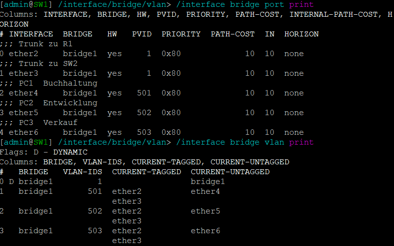

# Aufgabe 6 Labor Übung 

## 6.1. Übung 3 – VLANs programmieren und beobachten

Als klassische VLAN Aufgabe wird gerne die Aufteilung eines Netzwerkes für verschiedene Abteilungen verwendet. Jede Abteilung erhält dafür ein eigenes VLAN. Ihre Aufgabe besteht nun darin, dass Netzwerk in GNS3 aufzubauen, zu konfigurieren und Messungen mit Wireshark durchzuführen.
### 6.1.1. Lernziele

Sie sind in der Lage auf MikroTik Routern VLANs zu programmieren. Sie können VLAN Tags mit Wireshark auslesen.
### 6.1.2. Aufgabe




### 6.1.3 Ausführung der Befehle

**Ip Zuteilung**

192.168.20.0/24  
192.168.30.0/24  
192.168.40.0/24  
  
PC1:192.168.20.5  
PC2:192.168.30.5  
PC3:192.168.40.5  
PC4:192.168.20.6  
PC5:192.168.30.6  
PC6:192.168.40.6  

Führe aus auf jeweils angegebenen PC: ip (Adresse)

#### Neue VLAN Bridge erstellen

Führe den folgenden Befehl aus:

```cmd
/interface bridge add name=bridge1 protocol-mode=none vlan-filtering=yes
```	

#### Einen Port (Only Untagged) zu einer Bridge hinzufügen (z.B. für ein Endgerät)
```cmd
/interface bridge port add bridge=bridge1 comment="VLAN 101 – Buchhaltung" frame-types=admit-only-untagged-and-priority-tagged hw=no interface=ether4 pvid=101
```
```cmd
/interface bridge port add bridge=bridge1 comment="VLAN 102 – Entwicklung" frame-types=admit-only-untagged-and-priority-tagged hw=no interface=ether5 pvid=102
```
```cmd
/interface bridge port add bridge=bridge1 comment="VLAN 103 – Verkauf" frame-types=admit-only-untagged-and-priority-tagged hw=no interface=ether6 pvid=103
```

#### Einen Port (Only Tagged) zu einer Bridge hinzufügen

```cmd
/interface bridge port add bridge=bridge1 frame-types=admit-only-vlan-tagged hw=no interface=ether8
```
#### Ein VLAN einer Bridge hinzufügen, sowie «tagged» und «untagged» ports definieren.
```cmd
/interface bridge vlan add bridge=bridge1 comment="VLAN 101" tagged=ether8 untagged=ether4 vlan-ids=101
```	
```cmd
/interface bridge vlan add bridge=bridge1 comment="VLAN 102" tagged=ether8 untagged=ether5 vlan-ids=102
```		
```cmd
/interface bridge vlan add bridge=bridge1 comment="VLAN 103" tagged=ether8 untagged=ether6 vlan-ids=103
```	
#### Hostnamen Setzen auf SW1 und SW2
```cmd 
/system identity set name=SW1
```
```cmd
/system identity set name=SW2
```

#### **Teste ob Pings Funktionieren**




## 6.2. Übung 4 – Praxisnahes VLAN Beispiel mit Router und DHCP Server

In der Praxis erhält jedes VLAN ein eigenes Subnetz (Grundregeln: Ein Subnetz pro VLAN), ein Default Gateway, einen DHCP Server. In dieser Aufgabe erweitern Sie Ihr Netzwerk aus Übung 3 mit diesen Komponenten.

### 6.2.1 Lernziele

Sie können einen DHCP-Server konfigurieren. Sie können einen DNS-Server konfigurieren. Sie können einen Router für mehrere Subnetze konfigurieren.

### 6.2.2 Aufgabe



### Teil 1: Switch Konfiguration
### SW1

#### Erstelle bridge1

```cmd
/interface bridge
add name=bridge1 vlan-filtering=yes
```
#### Erstelle die Ports

```cmd
/interface bridge port
add bridge=bridge1 interface=ether2 frame-types=admit-only-vlan-tagged comment="Trunk zu R1"
add bridge=bridge1 interface=ether3 frame-types=admit-only-vlan-tagged comment="Trunk zu SW2"
add bridge=bridge1 interface=ether4 pvid=501 frame-types=admit-only-untagged-and-priority-tagged comment="PC1 – Buchhaltung"
add bridge=bridge1 interface=ether5 pvid=502 frame-types=admit-only-untagged-and-priority-tagged comment="PC2 – Entwicklung"
add bridge=bridge1 interface=ether6 pvid=503 frame-types=admit-only-untagged-and-priority-tagged comment="PC3 – Verkauf"

```
#### Erstelle VLANs

```cmd
/interface bridge vlan
add bridge=bridge1 vlan-ids=501 tagged=ether2,ether3 untagged=ether4
add bridge=bridge1 vlan-ids=502 tagged=ether2,ether3 untagged=ether5
add bridge=bridge1 vlan-ids=503 tagged=ether2,ether3 untagged=ether6
```

### SW2

#### Erstelle bridge1

```cmd
/interface bridge
add name=bridge1 vlan-filtering=yes
```
#### Erstelle die Ports

```cmd
/interface bridge port
add bridge=bridge1 interface=ether3 frame-types=admit-only-vlan-tagged comment="Trunk zu SW1"
add bridge=bridge1 interface=ether4 pvid=501 frame-types=admit-only-untagged-and-priority-tagged comment="PC4 – Buchhaltung"
add bridge=bridge1 interface=ether5 pvid=502 frame-types=admit-only-untagged-and-priority-tagged comment="PC5 – Entwicklung"
add bridge=bridge1 interface=ether6 pvid=503 frame-types=admit-only-untagged-and-priority-tagged comment="PC6 – Verkauf"


```
#### Erstelle VLANs

```cmd
/interface bridge vlan
add bridge=bridge1 vlan-ids=501 tagged=ether3 untagged=ether4
add bridge=bridge1 vlan-ids=502 tagged=ether3 untagged=ether5
add bridge=bridge1 vlan-ids=503 tagged=ether3 untagged=ether6
```

## Teil 2: R1 Konfiguration

#### Füge Vlans Hinzu
```cmd
/interface vlan
add interface=ether2 vlan-id=501 name=ether2_vlan501
add interface=ether2 vlan-id=502 name=ether2_vlan502
add interface=ether2 vlan-id=503 name=ether2_vlan503
```	
#### Füge IPs Hinzu
```cmd
/ip address
add address=192.168.55.1/24 interface=ether2_vlan501
add address=192.168.65.1/24 interface=ether2_vlan502
add address=192.168.75.1/24 interface=ether2_vlan503

```	
#### Erstelle Pools
```cmd
/ip pool
add name=pool501 ranges=192.168.55.10-192.168.55.100
add name=pool502 ranges=192.168.65.10-192.168.65.100
add name=pool503 ranges=192.168.75.10-192.168.75.100
```	
#### Füge DHCP-Server Hinzu
```cmd
/ip dhcp-server
add address-pool=pool501 interface=ether2_vlan501 name=dhcp501
add address-pool=pool502 interface=ether2_vlan502 name=dhcp502
add address-pool=pool503 interface=ether2_vlan503 name=dhcp503

```	
#### Füge Gateways Hinzu
```cmd
/ip dhcp-server network
add address=192.168.55.0/24 gateway=192.168.55.1
add address=192.168.65.0/24 gateway=192.168.65.1
add address=192.168.75.0/24 gateway=192.168.75.1

```	
#### Aktiviere die DHCP-Server
```cmd
/ip dhcp-server enable [find]
```	
#### Fehler behebung
Mir ist bei diesem auftrag einen Fehler aufgetreten. Ich habe ether2/3 nicht korrekt gesetzt. Er war nie auf Tagged-only

#### SW1
```cmd
/interface bridge port set [find where interface=ether2] frame-types=admit-only-vlan-tagged
``` 
#### SW2
```cmd
/interface bridge port set [find where interface=ether3] frame-types=admit-only-vlan-tagged
``` 

## Teil 3: VPCS Richtig einstellen
Ersetze in der Config die Zeile IP mit dhcp. Führe durch von PC1-PC6.
Danach gehe auf die Kommandozeile und schreibe: dhcp

## Teil 4: Test Phase
Nun wenn alles ausgeführt wurde, teste ob konfigurationen richtig aussehen. Wenn alles so wie auf den Screenshots aussieht, hast du den Auftrag geschafft.

### Bei R1




### Bei SW1


