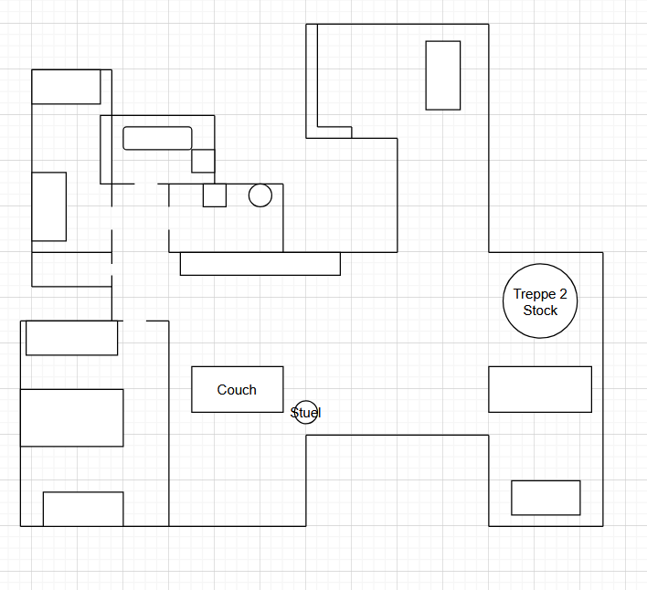
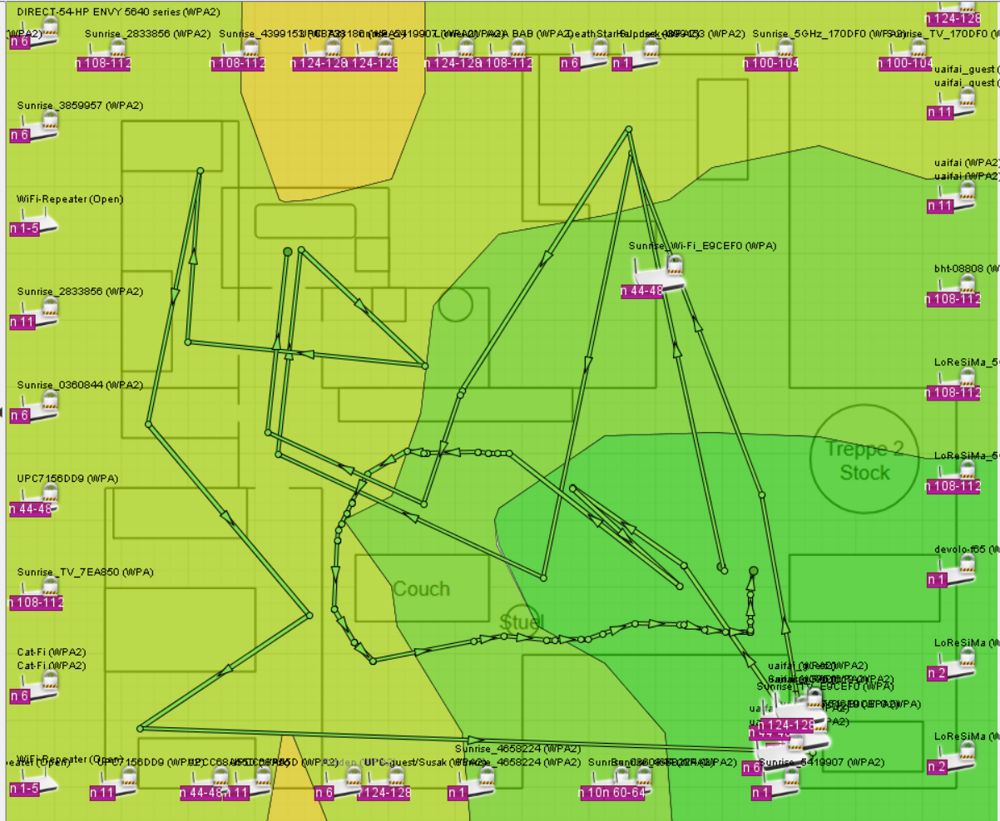

# Wlan Auftrag

## Ziel
In dieser Übung soll die Signalqualität in der eigenen Wohnung / Haus ausgemessen und dokumentiert werden.

## Lernprodukt
A4 Dokument (PDF) oder Seite in Markdown mit folgenden Inhalt:

Grundriss der Wohnung / Haus mit Heatmap
Eigene(r) WLAN Accesspoint(s) markiert
Marke + Typ des WLAN Accesspoint(s)

## Tools

Ekahau Heatmapper (Windows)- Verfügbar über Sharepoint

Net Spot FREE Edition (MacOs) - www.netspotapp.com

## Vorgehen

- Grundriss vorbereiten: Bestehende Grundrisszeichnung als Bilddatei auf den eigenen Computer laden oder  Grundriss mithilfe von draw.io erstellen

- Wireless Site Survey Tools auswählen (siehe Tools) und auf eigenen Computer installieren.
- Grundriss als Bilddatei in die gewünschte Software einlesen.
- Durch die Wohnung laufen und an diverse Punkten in der Wohnung auf dem Grundriss an den entsprechenden Punkt klicken.
- Heatmap abspeichern (Screenshot machen)
- Dokument mit Heatmap und den geforderten Informationen (siehe Lernprodukt) erstellen.

## Draw.io Skitze 

## Heat Map

 ### Analyse der Signalqualität

Meine Heatmap zeigt, dass die Signalstärke im Wohnzimmer am stärksten ist. Richtung Flur und Esszimmer, nimmt die signal stärke einwenig ab. Im berreich bad, gästezimmer und Schlafzimmer, ist dan die Signal stärke am wenigsten stark ausgeprägt. Dies vermute ich liegt an der Empfernung des routers und die dicken wände zwischen den räumen. 